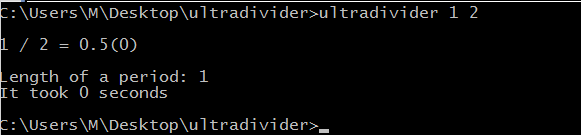
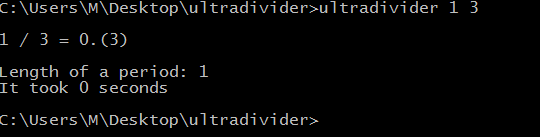
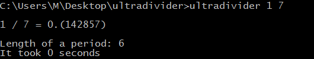
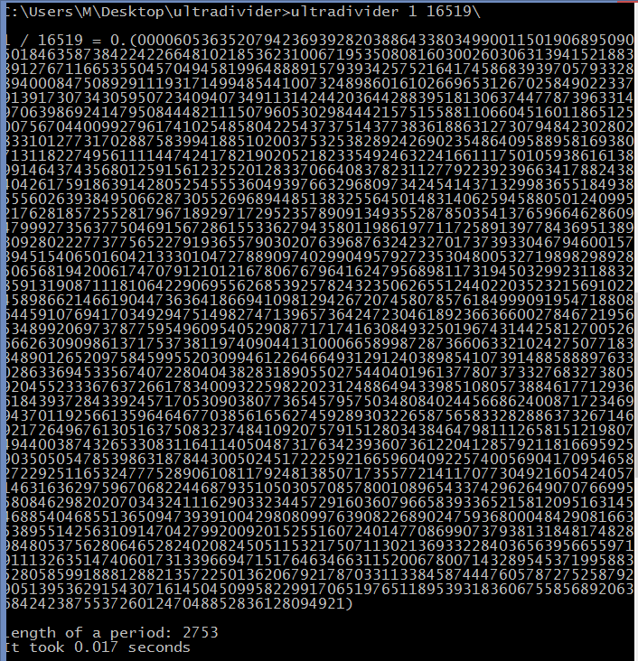
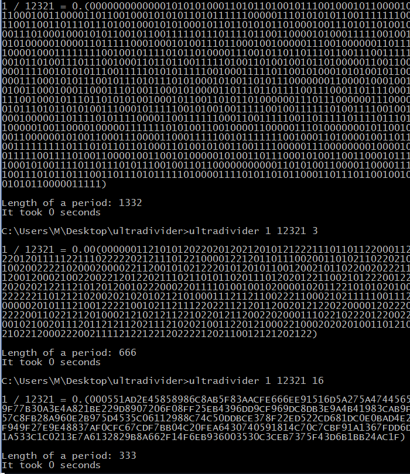
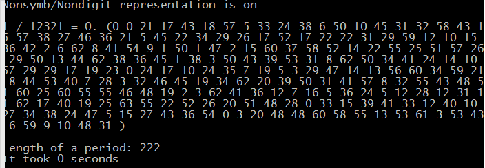
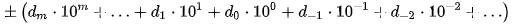
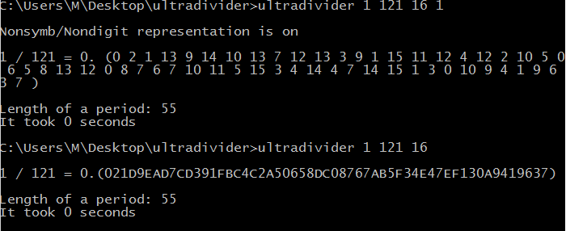

# Ultradivider
A program that divides two integers with 100% accuracy in any base/radix by detemining start and end of repeating digits with no approximation

## _Main Purpose_
Is to determine most accurate representations of a fraction in decimal (or in other bases like binary etc.) from.

To determine full length of a period and represent it in full.

In cmd write *ultradivider n k*

Where:
- *n* is n in n / k
- *k* is k in n / k

If fraction has no period, them period is equal to 0 in period
 </img>

Normal calculators determine an answer for 1 / 3 as 0.333333333333.... While Ultradivider determines that 3 is a repeating decimal

 </img>

Same goes (for example) for 1 / 7. While normaly we would get aprox 0.14285714286.... Ultra divider determines that digits 142857 are in period and repeat forever 

 </img>

Period can become quite long for larger numbers. For example 1 / 16519 which is aprox 0.000060536352 in actuality is equal to what you see below

 </img>

In reality, decimal expression has a period of 2753 digits. 

## _Change Base_

Length of a period is strongly determined by base/radix that we are using. You can change base in Ultradivider to get different results by adding a number after *k*

Getting *ultradivider n k base*

 </img>

## _Nondigital/Nonsymbolic Represintation_

Ultradivider uses 60 symbols for digits:

*0123456789ABCDEFGHJKLMNOPQRSTUVWXYZabcdefghjklmnopqrstuvwxyz*

But you can use larger bases such base 100, 128, 1000, 9999 etc. The result that you're going to get will be shown in nondigital/nonsymbolic represintaion

 </img>

Which just means that every number that is showen on screen is corresponds to a needed individual digit in formula below

 </img>

You can force nondigital/nonsymbolic represintation by typing 1 after base, like this 

*ultradivider n k base nonsymb* 

 </img>

